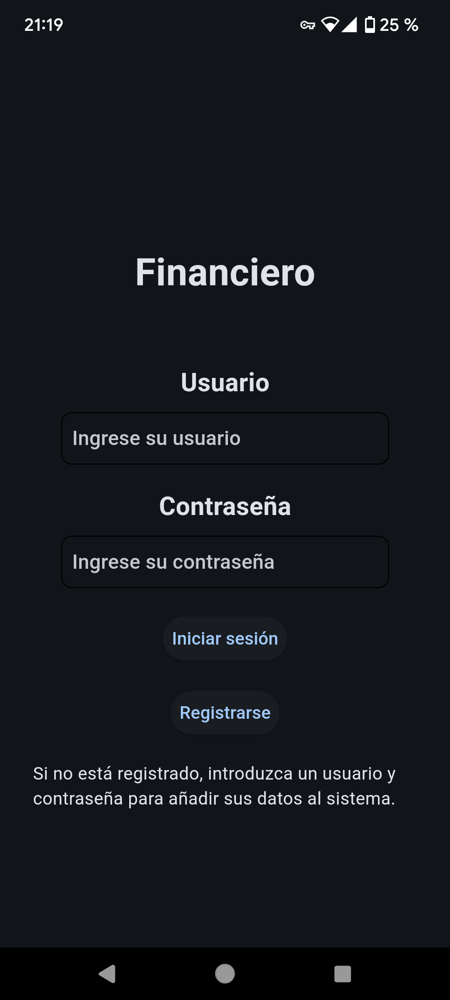

<h1 align="center" id="title">FINANCIERO</h1>

<p id="description">Este proyecto es mi trabajo de fin de grado, se trata de una pequeña aplicación financiera. Desarrollada en Python, utiliza una base de datos MongoDB en un contenedor Docker. Esta diseñada para que sea sencilla de iniciar y usar.</p>

<h2>Imágenes del proyecto:</h2>
<p align="center">
   
</p>

<h2>Ejecución con Docker:</h2>
<h3>- Programas necesarios: </h3>

* Docker 27.4.0
* Python 3.13

<h3>- Pasos de instalación: </h3>

* Descargar el repositorio:
```bash
   git clone https://github.com/DCEtech/financiero.git
```
* Iniciar Docker.
* Crear un arhcivo .venv dentro del proyecto:
```bash
   python -m venv .venv
```
* Activamos el entorno virtual de Python: 
```bash
   cd .venv/Scripts 
   activate
```
* Instalamos las librerías ubicadas en requirements.txt:
```bash
   pip install -r ../../requirements.txt
```
* Renombramos el env.example ubicado en el directorio raíz: 
```bash
   ren .env.example .env
```
* Ejecutar el archivo .bat en el directorio raíz.
```bash
   run
```

<h2>Ejecución con MongoDB:</h2>
<h3>- Programas necesarios: </h3>

* MongoDB
* Python 3.12

<h3>- Pasos de instalación: </h3>

* Descargar el repositorio:
```bash
   git clone https://github.com/DCEtech/financiero.git
```
* Servicio de MonogoDB activo.
* Crear un arhcivo .venv dentro del proyecto:
```bash
   python -m venv .venv
```
* Activamos el entorno virtual de Python: 
```bash
   cd .venv/Scripts 
   activate
```
* Instalamos las librerías ubicadas en requirements.txt:
```bash
   pip install -r ../../requirements.txt
```
* Renombramos el env.example ubicado en el directorio raíz: 
```bash
   ren .env.example .env
```
* Modificamos el archivo .env asignandole la URI de nuestro servicio MongoDB.
* Ejecutamos el comando para iniciar la aplicación: 
```bash
   flet run app/main.py
```

<h2>Testing en Android:</h2>
<h3>- Programas y requisitos necesarios: </h3>


* Aplicación Flet instalada en le dispositivo movil
* Encontrarse en la misma red local 
* MongoDB

<h3>- Pasos de instalación: </h3>

* Descargar el repositorio:
```bash
   git clone https://github.com/DCEtech/financiero.git
```
* Servicio de MonogoDB activo.
* Crear un arhcivo .venv dentro del proyecto:
```bash
   python -m venv .venv
```
* Activamos el entorno virtual de Python: 
```bash
   cd .venv/Scripts 
   activate
```
* Instalamos las librerías ubicadas en requirements.txt:
```bash
   pip install -r ../../requirements.txt
```
* Renombramos el env.example ubicado en el directorio raíz: 
```bash
   ren .env.example .env
```
* Modificamos el archivo .env asignandole la URI de nuestro servicio MongoDB.
* Ejecutamos el comando para iniciar la aplicación: 
```bash
   flet run app/ --android
```
* Se generará un código QR en la consola, lo escaneamos con la cámara del movil y nos mostrara la app.




<h2>Estructura del proyecto:</h2>

* app/: Código fuente de la aplicación.
* config/: Configuraciones adicionales.
* .env.example: Variables de entorno como ejemplo, validas para Docker y MongoDB en puerto 27017.
* gitignore: Archivos y carpetas que no deben ser incluidos en el repositorio.
* run.bat: Script principal para iniciar la aplicación y el servicio MongoDB en el contenedor Docker.

<h2>💻 Realizado con:</h2>

Tecnologías usadas en el proyecto:

*   Python
*   Flet
*   Matplotlib
*   MongoDB
*   Docker
